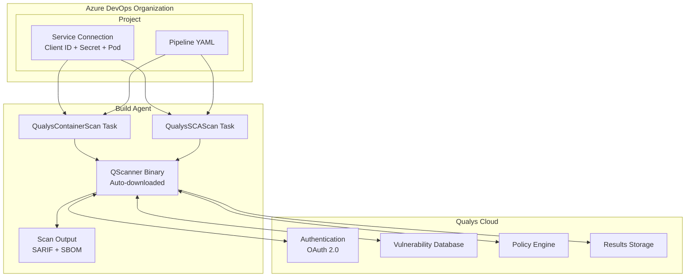
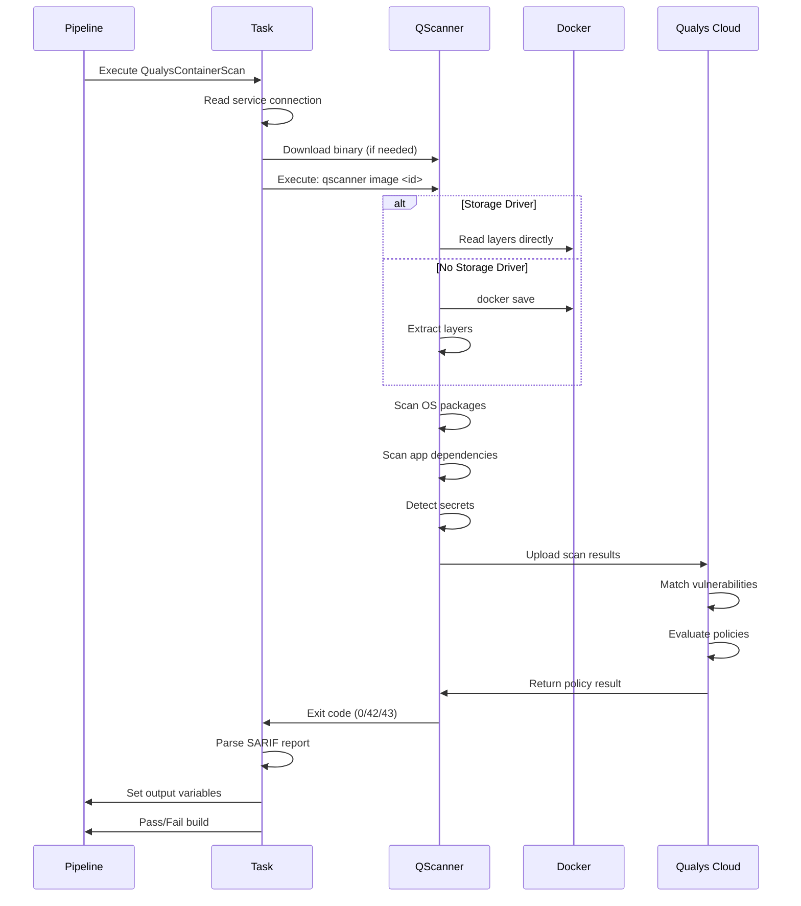
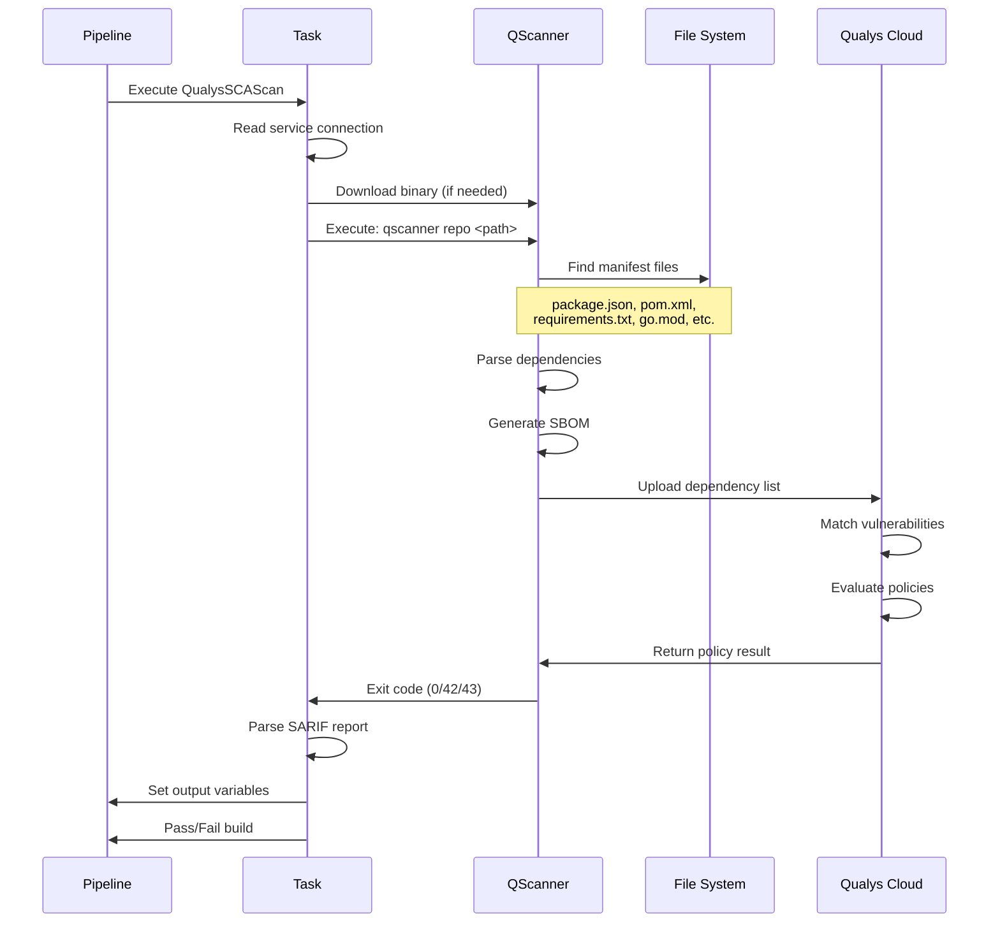
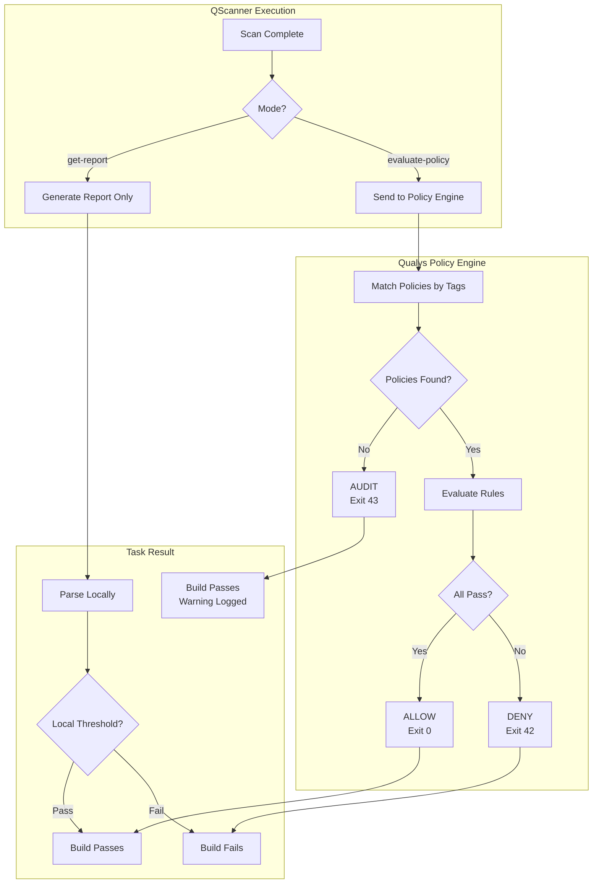
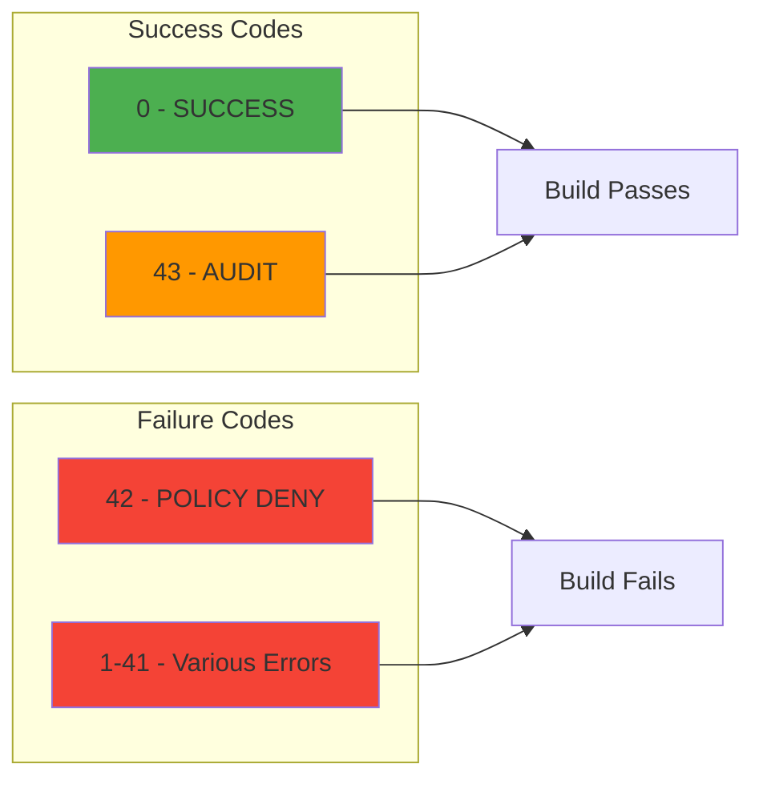
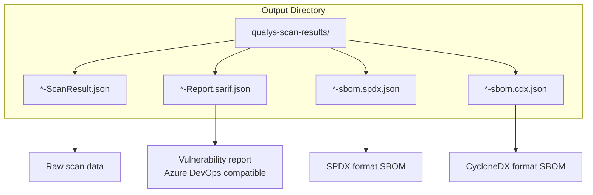
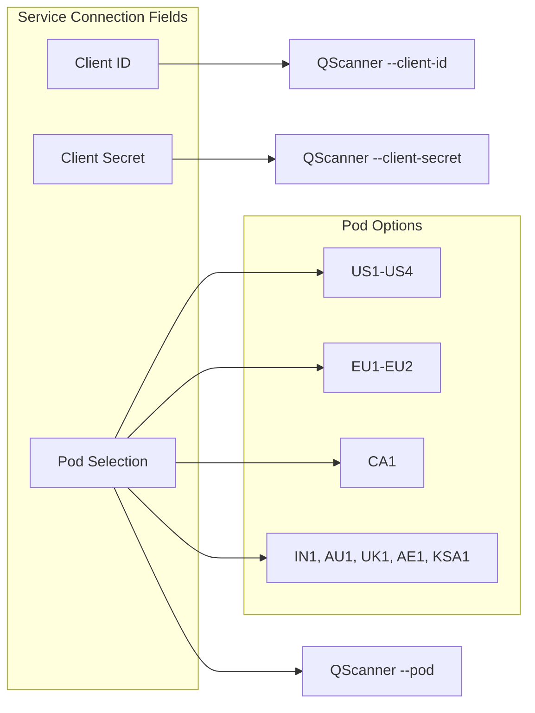
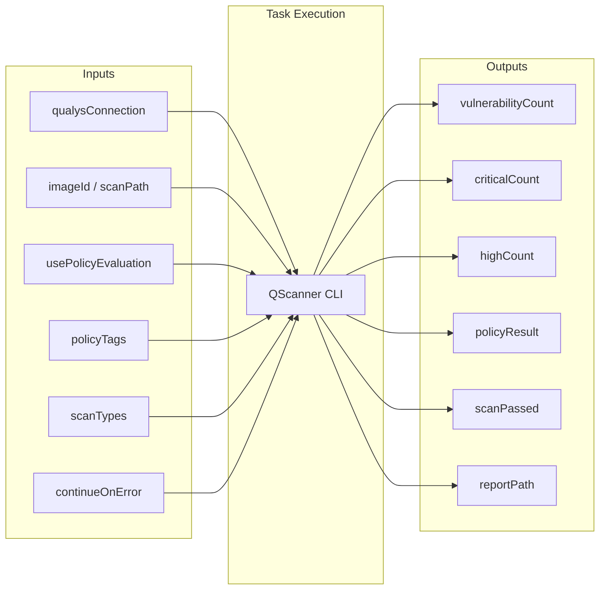

# Qualys Azure DevOps Extension - Architecture

## High-Level Architecture

## Container Scan Flow

## SCA Scan Flow

## Policy Evaluation

## Exit Codes

## File Output Structure

## Service Connection Configuration

## Task Input/Output

