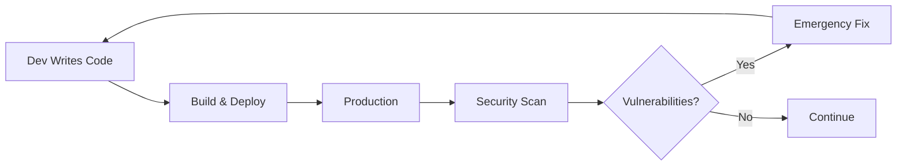
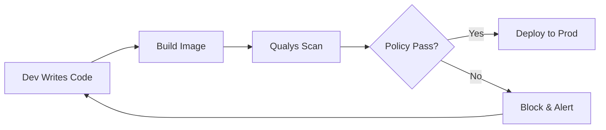
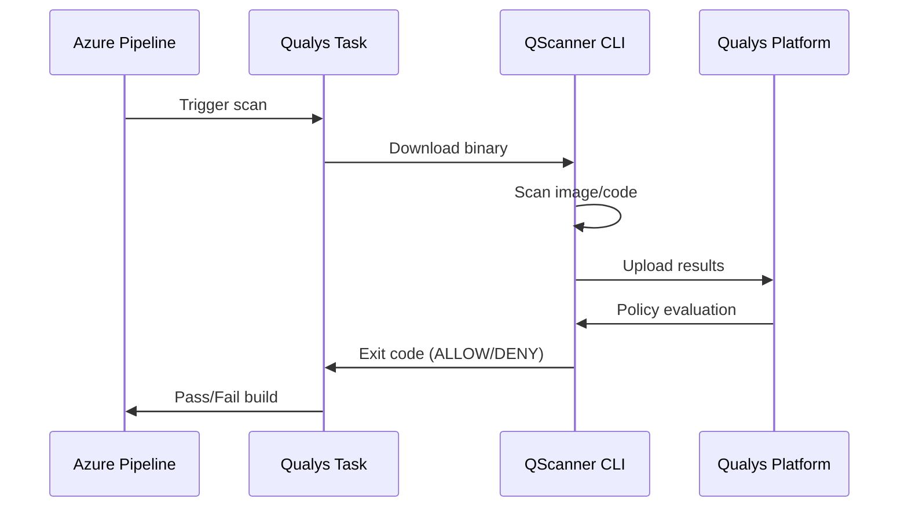
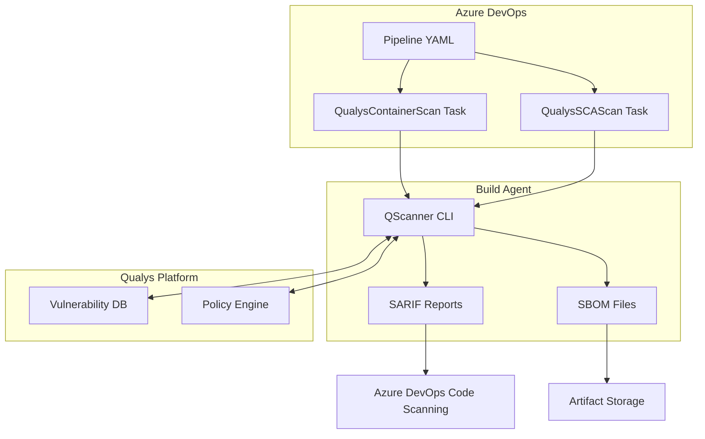
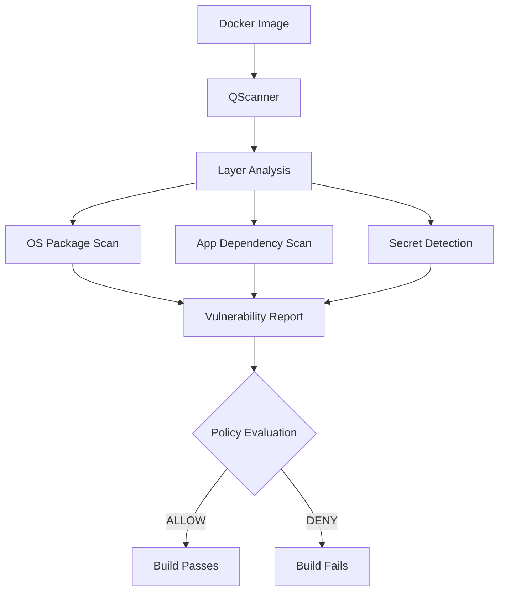
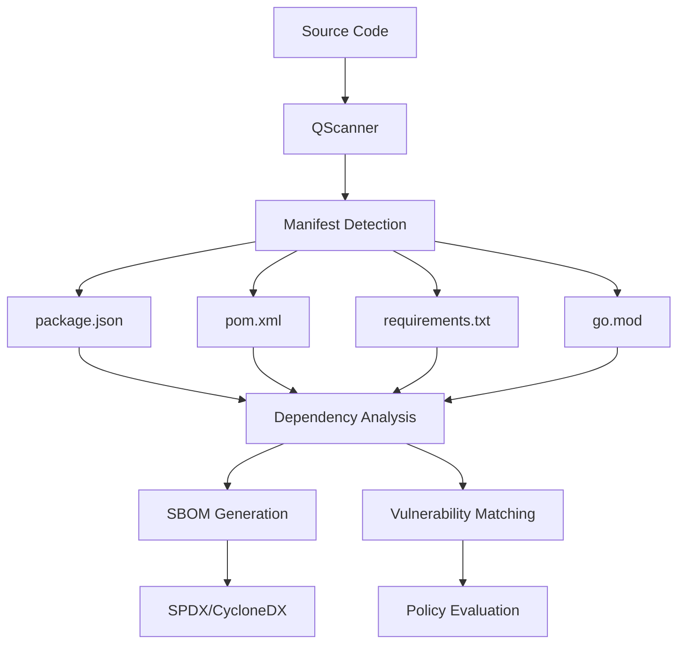
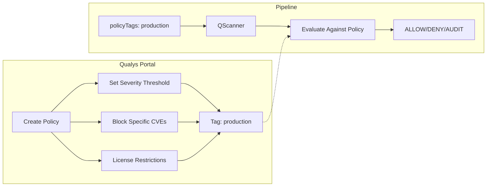
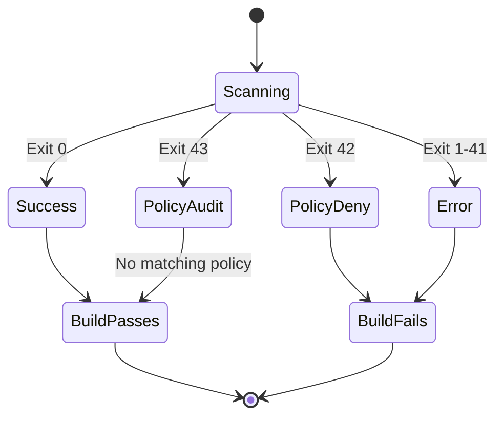

# Shift-Left Security: Integrating Qualys Scanning into Azure DevOps Pipelines

Modern software delivery demands security at every stage. With the Qualys Azure DevOps Extension, teams can embed vulnerability scanning directly into their CI/CD pipelines—catching security issues before they reach production.

## The Problem: Security as an Afterthought

Traditional security workflows create friction:



Issues found in production are expensive to fix and risk customer data.

## The Solution: Shift-Left with Pipeline Integration

By integrating Qualys scanning into Azure DevOps, security becomes part of the build process:



Vulnerabilities are caught before deployment, reducing risk and remediation costs.

## How It Works

The extension uses the Qualys QScanner CLI to scan container images and code dependencies directly on the build agent:



## Architecture Overview



## Two Scanning Modes

### Container Security

Scan Docker images for OS package and application vulnerabilities:



### Software Composition Analysis (SCA)

Scan code repositories for vulnerable dependencies:



## Policy-Based Gating

Define security policies in Qualys and enforce them automatically:



## Exit Code Flow

QScanner uses exit codes to communicate results:



## Sample Pipeline

```yaml
trigger:
  - main

pool:
  vmImage: 'ubuntu-latest'

steps:
  - task: Docker@2
    displayName: 'Build Image'
    inputs:
      command: build
      tags: $(Build.BuildId)

  - task: QualysContainerScan@2
    displayName: 'Security Scan'
    inputs:
      qualysConnection: 'QualysConnection'
      imageId: 'myapp:$(Build.BuildId)'
      usePolicyEvaluation: true
      policyTags: 'production'

  - task: Docker@2
    displayName: 'Push to Registry'
    condition: succeeded()
    inputs:
      command: push
```

## Benefits

| Before | After |
|--------|-------|
| Manual security reviews | Automated scanning |
| Vulnerabilities in production | Issues caught at build time |
| Reactive remediation | Proactive prevention |
| Security as blocker | Security as enabler |

## Getting Started

1. Install the extension from the Visual Studio Marketplace
2. Create a Qualys service connection with your API credentials
3. Add scanning tasks to your pipeline YAML
4. Configure policies in the Qualys portal
5. Build with confidence

## Conclusion

Integrating Qualys scanning into Azure DevOps transforms security from a gate at the end of development into a continuous practice. Developers get immediate feedback, security teams get visibility, and organizations reduce risk—all without slowing down delivery.

The Qualys Azure DevOps Extension brings enterprise-grade vulnerability scanning to your pipelines with minimal configuration and maximum impact.

---

*Ready to shift left? Install the Qualys Security Scanner extension today.*
