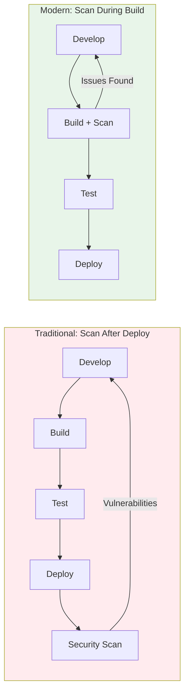
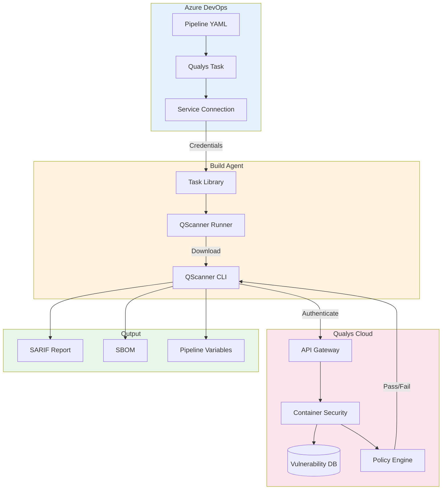
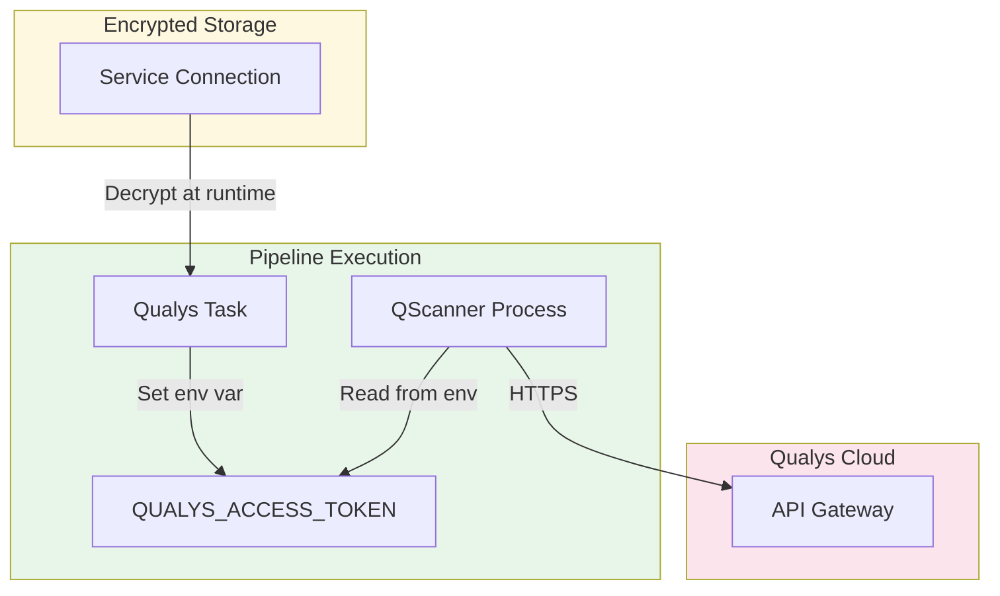
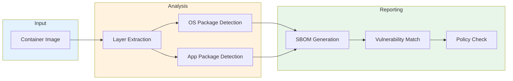
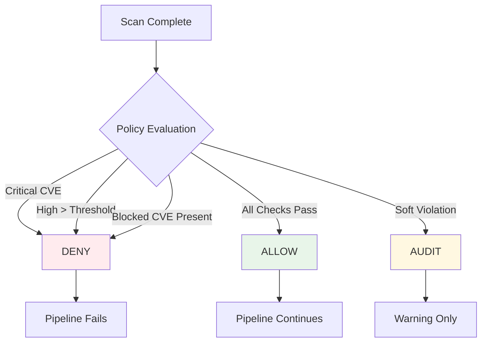

# Vulnerability Scanning in Azure DevOps Pipelines with Qualys QScanner

Security vulnerabilities in container images and application dependencies represent one of the most common attack vectors in modern software. The Log4Shell vulnerability demonstrated how a single vulnerable dependency can expose thousands of organizations overnight. When the next critical CVE drops, the question is not whether your applications contain it. The question is whether you can find it before attackers do.

This post explores how Qualys QScanner integrates with Azure DevOps to provide continuous vulnerability scanning directly in your CI/CD pipelines.

## The Build Pipeline Security Gap

Traditional security scanning happens late in the software lifecycle. Code ships to production, then security teams run periodic assessments. Vulnerabilities discovered at this stage cost 10x more to fix than vulnerabilities caught during development. Developers have moved on to new features. Context is lost. Urgent hotfixes disrupt planned work.

The solution is shifting security left. Scan code during the build phase when developers have full context and fixes are simple.



## Architecture Overview

The Qualys Security Scanner extension for Azure DevOps provides two pipeline tasks: QualysContainerScan for container images and QualysSCAScan for source code dependencies. Both tasks execute QScanner, a standalone CLI that analyzes targets and reports findings to Qualys Cloud.



When a pipeline executes a Qualys task:

1. The task reads credentials from the Azure DevOps service connection
2. QScanner Runner downloads the QScanner binary if not cached
3. QScanner authenticates with Qualys using the access token
4. For container scans, QScanner analyzes image layers and packages
5. For SCA scans, QScanner parses manifest files and detects dependencies
6. Results upload to Qualys Container Security for vulnerability matching
7. Policy evaluation determines pass/fail status
8. Reports generate in SARIF and SBOM formats
9. Pipeline variables expose results for downstream steps

## Credential Security

Access tokens never appear in pipeline logs. The extension stores credentials encrypted in Azure DevOps service connections and passes them to QScanner via environment variable.



Key security properties:

- Tokens stored encrypted in Azure DevOps
- Tokens passed via environment variable, not CLI argument
- CLI arguments visible in logs exclude sensitive values
- Only boolean presence of token logged, never the value
- All API communication over HTTPS

## Container Image Scanning

The QualysContainerScan task analyzes Docker images for vulnerabilities in OS packages and application dependencies. QScanner supports multiple container storage backends including Docker, containerd, and Podman.

```yaml
- task: QualysContainerScan@2
  inputs:
    qualysConnection: 'QualysConnection'
    imageId: 'myapp:$(Build.BuildId)'
    usePolicyEvaluation: true
```

QScanner performs full layer analysis without executing containers. The scan process:

1. Pulls image manifest and layer digests
2. Extracts filesystem contents from each layer
3. Detects OS packages (apt, rpm, apk)
4. Identifies application packages (npm, pip, maven, go)
5. Uploads SBOM to Qualys for vulnerability matching
6. Retrieves vulnerability report with QID mappings



## Software Composition Analysis

The QualysSCAScan task scans source code repositories for vulnerable dependencies. QScanner parses manifest files across all major package ecosystems.

```yaml
- task: QualysSCAScan@2
  inputs:
    qualysConnection: 'QualysConnection'
    scanPath: '$(Build.SourcesDirectory)'
    generateSbom: true
    sbomFormat: 'spdx,cyclonedx'
```

Supported package managers:

| Ecosystem | Manifest Files |
|-----------|---------------|
| Node.js | package.json, package-lock.json, yarn.lock |
| Python | requirements.txt, Pipfile.lock, poetry.lock |
| Java | pom.xml, build.gradle, gradle.lockfile |
| Go | go.mod, go.sum |
| .NET | packages.config, *.csproj, packages.lock.json |
| Rust | Cargo.lock |
| Ruby | Gemfile.lock |
| PHP | composer.lock |

## Policy-Based Build Gating

Qualys policies define rules for automated pass/fail decisions. Security teams configure policies centrally in the Qualys Console. Pipelines evaluate against these policies without hardcoding thresholds in YAML.



Policy rules include:

- **Severity thresholds**: Fail if critical or high vulnerabilities exceed count
- **CVE blocking**: Fail if specific CVEs are present
- **Age rules**: Fail if vulnerabilities older than N days remain unfixed
- **License compliance**: Fail if prohibited open source licenses detected

This separation lets security teams define policy while developers focus on building features. Changes to security requirements propagate automatically without modifying pipeline YAML.

## Output Formats

QScanner generates multiple output formats for different consumers.

**SARIF Reports**: Static Analysis Results Interchange Format integrates with GitHub Advanced Security, Azure DevOps Code Scanning, and IDE extensions. Developers see vulnerability annotations directly in pull requests.

**SBOM**: Software Bill of Materials in SPDX and CycloneDX formats provides complete dependency inventory for compliance and supply chain security.

**Pipeline Variables**: Tasks set output variables for use in downstream steps:

| Variable | Description |
|----------|-------------|
| vulnerabilityCount | Total vulnerabilities found |
| criticalCount | Critical severity count |
| highCount | High severity count |
| policyResult | ALLOW, DENY, or AUDIT |
| scanPassed | Boolean pass/fail |
| reportPath | Path to SARIF report |

## Deployment Patterns

### Basic Pipeline

The simplest integration adds scan tasks to an existing pipeline:

```yaml
trigger:
  - main

pool:
  vmImage: 'ubuntu-latest'

steps:
  - task: QualysSCAScan@2
    inputs:
      qualysConnection: 'QualysConnection'
      scanPath: '$(Build.SourcesDirectory)'

  - task: Docker@2
    inputs:
      command: 'build'
      tags: '$(Build.BuildId)'

  - task: QualysContainerScan@2
    inputs:
      qualysConnection: 'QualysConnection'
      imageId: 'myapp:$(Build.BuildId)'
```

### Security Gate Stage

For strict enforcement, add a dedicated security stage that must pass before deployment:

```yaml
stages:
  - stage: Security
    jobs:
      - job: Scan
        steps:
          - task: QualysSCAScan@2
            inputs:
              qualysConnection: 'QualysConnection'
              scanPath: '$(Build.SourcesDirectory)'
              usePolicyEvaluation: true

          - task: QualysContainerScan@2
            inputs:
              qualysConnection: 'QualysConnection'
              imageId: 'myapp:$(Build.BuildId)'
              usePolicyEvaluation: true

  - stage: Deploy
    dependsOn: Security
    condition: succeeded()
    jobs:
      - deployment: Production
        environment: 'production'
```

### Parallel Scanning

Run container and SCA scans in parallel to minimize pipeline duration:

```yaml
stages:
  - stage: Build
    jobs:
      - job: BuildImage
        steps:
          - task: Docker@2
            inputs:
              command: 'build'

      - job: SCAScanning
        steps:
          - task: QualysSCAScan@2
            inputs:
              qualysConnection: 'QualysConnection'
              scanPath: '$(Build.SourcesDirectory)'

  - stage: ContainerScan
    dependsOn: Build
    jobs:
      - job: Scan
        steps:
          - task: QualysContainerScan@2
            inputs:
              qualysConnection: 'QualysConnection'
              imageId: 'myapp:$(Build.BuildId)'
```

## Getting Started

To implement Qualys scanning in your Azure DevOps pipelines:

1. **Install the extension** from the Visual Studio Marketplace
2. **Create a service connection** in Project Settings with your Qualys access token and platform
3. **Add scan tasks** to your pipeline YAML
4. **Configure policies** in Qualys Console for automated gating
5. **Review results** in pipeline logs, SARIF reports, and Qualys TotalCloud dashboard

## Conclusion

Pipeline-integrated vulnerability scanning catches security issues when they are cheapest to fix. Developers see findings in the context of their changes. Policy enforcement prevents vulnerable code from reaching production. SBOM generation provides supply chain transparency.

The Qualys Security Scanner extension brings these capabilities to Azure DevOps without requiring changes to build infrastructure. QScanner downloads on demand, scans without container execution, and integrates with Qualys Cloud for enterprise-scale vulnerability management.

When the next critical vulnerability emerges, organizations running this integration will know within minutes which pipelines are affected. Policy controls will block vulnerable builds automatically. And developers will have the context they need to fix issues quickly.

Detection, prevention, and remediation. All within the development workflow.
